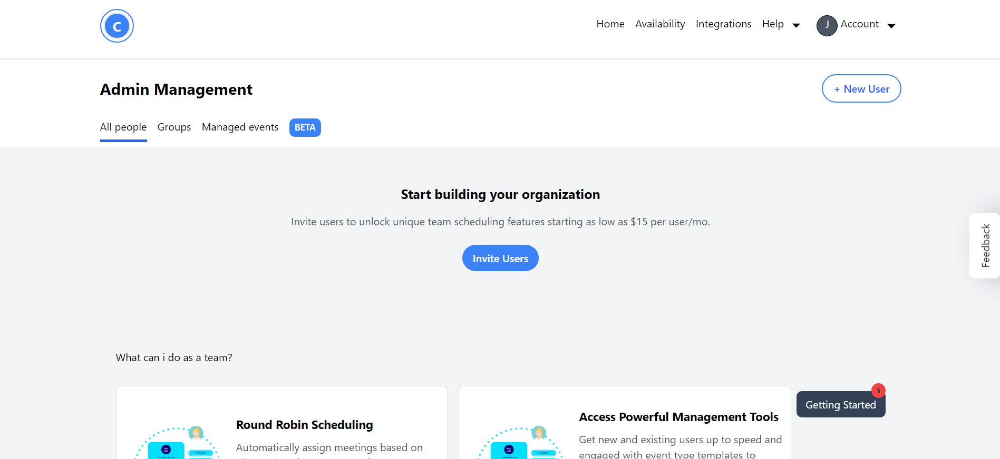

# Aenoxy Dashboard

Aenoxy Dashboard is a modern and visually appealing dashboard application built with React.js and designed using Framer Motion for smooth animations and transitions. This dashboard provides an intuitive user interface to manage and monitor various aspects of the Aenoxy platform.

## Live Demo

You can check out the live demo of the Aenoxy Dashboard [here](https://aenoxybyom.netlify.app).

## Screenshots



## Features

- Clean and modern UI design
- Animated sidebar with smooth transitions
- Interactive charts with engaging animations
- Responsive layout for optimal viewing on various devices
- Easy navigation and intuitive user experience

## Technologies Used

- React.js
- Framer Motion
- Vite (Build Tool)
- Tailwind CSS

## Getting Started

To run the Aenoxy Dashboard locally, follow these steps:

1. Clone the repository:

```bash
git clone https://github.com/your-username/aenoxy-dashboard.git


```
## Navigate to the project directory:

cd aenoxy-dashboard


## Install dependencies:

npm install


## Start the development server:

npm run dev


## Open your web browser and visit http://localhost:5173 to see the Aenoxy Dashboard in action.